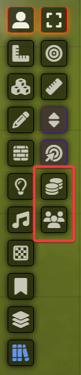
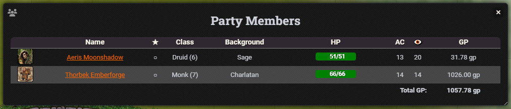
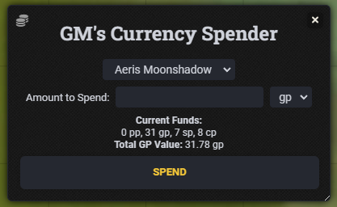
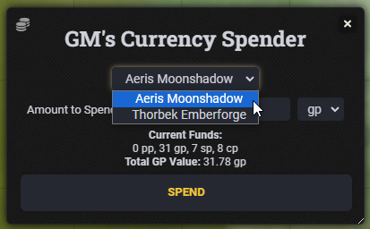
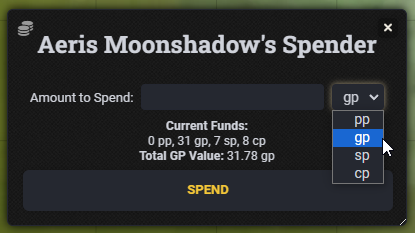
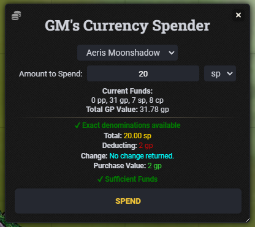
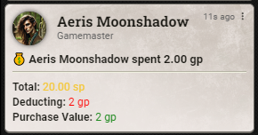
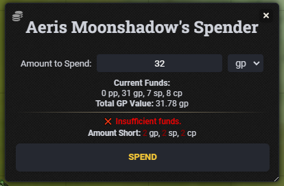

# BowenArrows Utils

A collection of useful tools for D&D 5e

## Installation

1. Open the Add-on Modules tab in the Configuration and Setup dialog.
2. Click Install Module and search for "Actor Attribute List", or use the following manifest URL: `https://github.com/BowenArrows2K/bowenarrows-utils/releases/latest/download/module.json`
3. Install the module and activate it for your World using the checkbox in the 'Manage Modules' Dialog.

## Usage

This Module adds two menus there is currently no configureation

### Party Members List

This "app" will display all Player Owned and assigned actors

The names are clickable and the HP can be updated by clicking on the first number and entering a value or +- a Number Inspration can be granted by clicking the dot under the ★. A ✨ will be displayed if the actor has Inspiration.

### Currency Spender

There are two versions of this "App"

The first is the GM version:

This version of the app features a dropdown to select from Player Owned and assigned actors:

Aside from that the two menus are almost identical featuring a dropdown for currency type selection and an entry field for how much of that coin you'd like to spend.

The above is an example of the Player version of the app

The app calculates which currency from an actors wallet should be used based on the type of coin entered then finds the best denominations to utilize.

It also displays how much coin they would need if the actor does not have enough funds:

